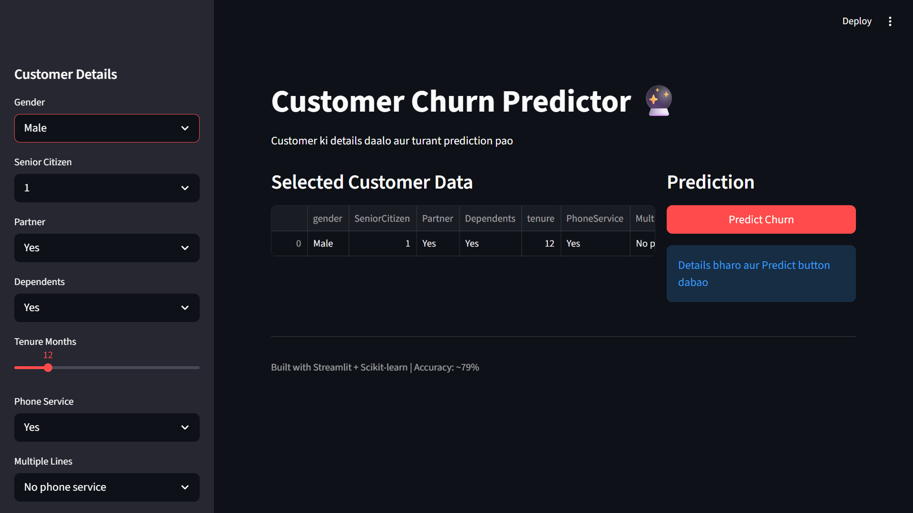
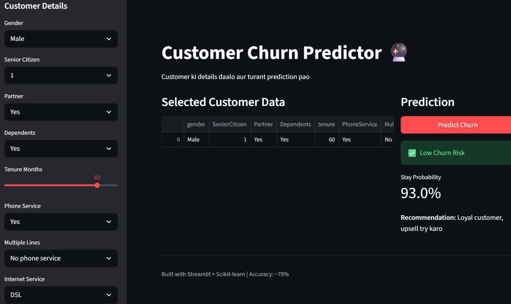
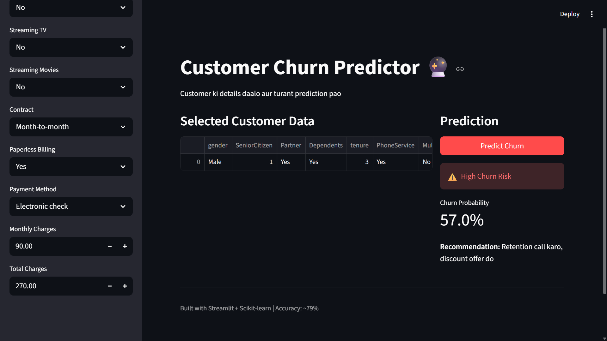

# Customer Churn Predictor 🔮

An end-to-end Machine Learning web app that predicts if a telecom customer will churn. Built with Python, Scikit-learn & Streamlit.

### 🚀 Live Demo
**[Click Here to Try the Live App](https://customer-churn-predictor-e6hpxpbtpmmzxyynysrgb5.streamlit.app/)**

### 📊 Model Performance
- **Algorithm:** Random Forest Classifier
- **Accuracy:** 79%
- **Dataset:** Telco Customer Churn from Kaggle
- **Features:** 19 customer attributes like Tenure, Contract, Monthly Charges

### 🛠️ Tech Stack
`Python` `Pandas` `Scikit-learn` `Streamlit` `Joblib` `NumPy`

### 📷 Dashboard Screenshots

**1. App Interface**


**2. High Churn Risk - 93% Churn Probability**


**3. Low Churn Risk - 57% Stay Probability** 


### 💻 How to Run Locally
```bash
git clone https://github.com/akash1234-design/customer-churn-predictor.git
cd customer-churn-predictor
pip install -r requirements.txt
streamlit run app.py
